<h1 align="center">🅼🅰🆁🆄🅺🅾🅼🅴 マルコメ🥳</h1>

<div align="center">
  
  
  
</div>

<h2 align="center">ミ★ 𝓚𝓷𝓸𝔀𝓵𝓮𝓭𝓰𝓮 ★彡</h2>

[](https://biomejs.dev/)
[](https://bun.sh/)
[](https://nodejs.org/)
[](https://nextjs.org/)
[](https://react.dev/)
[](https://www.typescriptlang.org/)
[](https://ecma-international.org/publications-and-standards/standards/ecma-262/)
[](https://www.python.org/)
[](https://tailwindcss.com/)
[](https://nginx.org/)
[](https://www.redhat.com/en/ansible-collaborative/)
[](https://www.docker.com/)
[](https://opentofu.org/)

<h2 align="center"><a href="https://wakatime.com/@Marukome">𓂀 𝔸𝕔𝕥𝕚𝕧𝕚𝕥𝕪 𓂀</a></h2>

<!--START_SECTION:waka-->

```txt
Other        60 hrs 46 mins  🟩🟩🟩🟩🟩🟩🟩🟩🟩🟩🟩🟩🟩🟩🟩🟩🟩🟩🟩🟩🟩🟩🟩⬜⬜   92.24 %
YAML         1 hr 59 mins    🟩⬜⬜⬜⬜⬜⬜⬜⬜⬜⬜⬜⬜⬜⬜⬜⬜⬜⬜⬜⬜⬜⬜⬜⬜   03.03 %
Markdown     1 hr 26 mins    🟨⬜⬜⬜⬜⬜⬜⬜⬜⬜⬜⬜⬜⬜⬜⬜⬜⬜⬜⬜⬜⬜⬜⬜⬜   02.18 %
Dockerfile   50 mins         🟨⬜⬜⬜⬜⬜⬜⬜⬜⬜⬜⬜⬜⬜⬜⬜⬜⬜⬜⬜⬜⬜⬜⬜⬜   01.29 %
Bash         31 mins         ⬜⬜⬜⬜⬜⬜⬜⬜⬜⬜⬜⬜⬜⬜⬜⬜⬜⬜⬜⬜⬜⬜⬜⬜⬜   00.79 %
```

<!--END_SECTION:waka-->

[](https://algora.io/profile/Marukome0743/)
